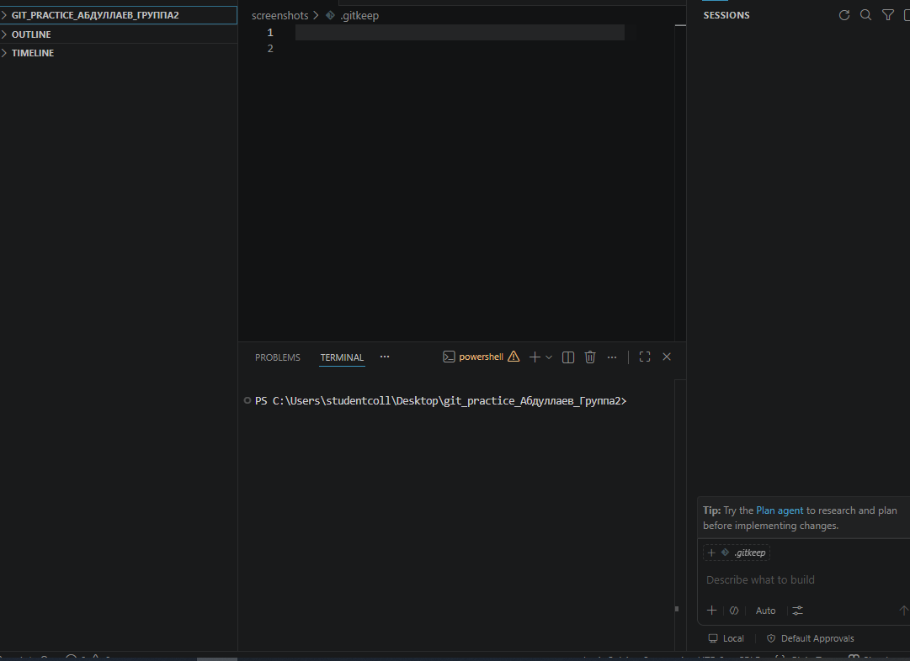

# Git Practice Project

## О проекте
Этот проект создан для выполнения контрольной работы по Git.

## Автор
- **ФИО:** Абдуллаев
- **Группа:** Группа2
- **GitHub:** [Ссылка на репозиторий](https://github.com/ВАШ_НИК/git_practice_Абдуллаев_Группа2)

## Что делали
1. Создание проекта.
2. Инициализация Git.
3. Настройка .gitignore.
4. Создание веток.
5. Слияние.
6. Fetch / Pull.
7. Разрешение конфликта.
8. Оформление отчёта.

## Что я понял(а) про .gitignore
- `.gitignore` помогает не отправлять в GitHub временные и секретные файлы.
- Файл `.env` нельзя публиковать, потому что в нём могут быть токены и пароли.
- Логи `*.log` обычно не нужны в репозитории.
- Папки `venv/` и `.venv/` не добавляют в Git, потому что их можно создать заново.
- Перед коммитом нужно проверять Source Control.

## Скриншоты

### 1. Первый коммит

### 2. Репозиторий на GitHub

### 3. Создание ветки

### 4. Merge ветки

### 5. Fetch / Pull

### 6. Итоговая история

## Вывод
В ходе выполнения контрольной работы я научился(ась) работать с Git в VS Code: инициализировать репозиторий, создавать ветки, выполнять слияние, разрешать конфликты и использовать .gitignore. Самым сложным было разрешение конфликтов при слиянии, но практика помогла закрепить эти навыки.